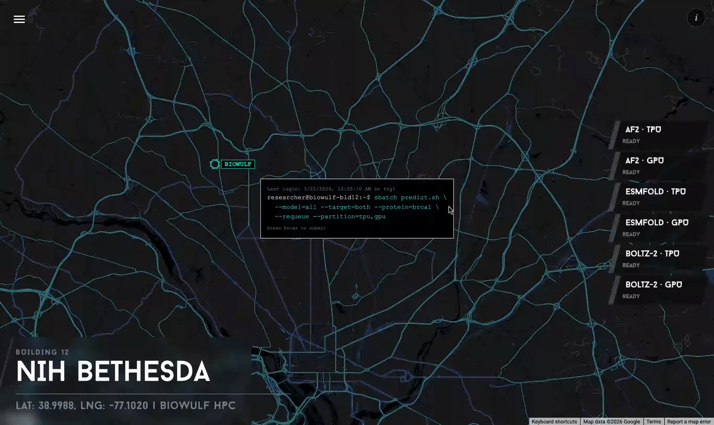
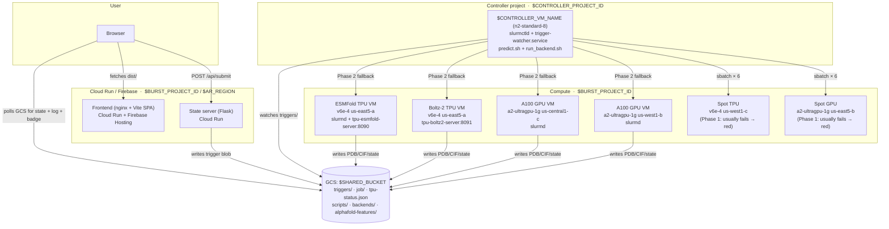

# NIH Biowulf Protein Structure Prediction Demo

Live demo: pressing Enter dispatches **6 real protein inference jobs** (3 models × 2 silicons) via Slurm from an on-prem-style controller to cloud compute nodes. TPU vs GPU race side-by-side; same code, same protein, different silicon.

This README is the complete bring-up manual. Every step assumes you're starting from zero and want a working clone. Follow top to bottom and you have the deployment.



## Reference deployment URLs

The reference deployment lives at:

- **Frontend** (Cloud Run): `https://protein-demo-frontend-<BURST_PROJECT_NUMBER>.<AR_REGION>.run.app`
- **State server** (Cloud Run): `https://protein-demo-server-<BURST_PROJECT_NUMBER>.<AR_REGION>.run.app`

Your URLs will use your own `$BURST_PROJECT_NUMBER` and Firebase site name.

## What happens when you press Enter

1. Frontend → `POST /api/submit` on the state server → writes `triggers/<timestamp>.json` to GCS
2. `trigger-watcher.service` on the controller VM polls GCS, picks up the trigger, runs `predict.sh`
3. `predict.sh` Phase 1: submits all 6 to **Spot partitions** (65s timeout, usually fail with no capacity → red on the map)
4. Phase 2: resubmits Spot failures to **guaranteed `tpu` / `gpu` partitions**
5. Each Slurm job downloads `run_backend.sh` + `backends/$BACKEND/predict.py` from GCS, runs inference, uploads PDB/CIF
6. TPU jobs hit pre-warmed model servers (ESMFold on the ESMFold VM at port 8090, Boltz-2 on a dedicated VM at port 8091)
7. Frontend polls GCS events directly + reads `tpu-status.json` for the warm badge

Total wall-clock: **~6 minutes** for all 6 backends (TPU chain serialized on the one v6e, GPU jobs parallel across regions).

## Architecture



## Models & silicon

| Backend | Model | Silicon | Time (warm) | Notes |
|---------|-------|---------|-------------|-------|
| `af2-tpu` | AlphaFold 2 | TPU v6e (ESMFold VM, JAX) | **~130s** | Kills ESMFold server pre-run for VFIO |
| `af2-gpu` | AlphaFold 2 | A100 GPU (us-central1) | ~350s | |
| `esmfold-tpu` | ESMFold | TPU v6e (ESMFold VM warm server) | **~12s** | torch_xla eager mode, priority lock |
| `esmfold-gpu` | ESMFold | A100 GPU (us-west1) | ~40s | |
| `boltz2-tpu` | Boltz-2 | TPU v6e (Boltz-2 VM warm server) | **~28s** | Separate VM, cross-VM fasta_content protocol |
| `boltz2-gpu` | Boltz-2 | A100 GPU (us-west1) | ~67s | |

ESMFold is pure inference (no MSA). AlphaFold runs inference only — MSAs are pre-computed offline by `scripts/generate_af2_features.py` and cached as `features.pkl` in `$SHARED_BUCKET/alphafold-features/`. Boltz-2 fetches MSAs live from the public ColabFold MSA server (`--use_msa_server`, ~21s data prep).

### Two TPU warm-server VMs

Two separate v6e VMs because combining ESMFold + Boltz-2 on a single v6e-4 (32 GB HBM) evicts the XLA op cache between calls. Split = each model gets full HBM headroom.

| TPU VM (reference names) | Server | Port | Container |
|--------|--------|------|-----------|
| ESMFold VM | `tpu-esmfold-server.py` + slurmd | 8090 | `slurm-tpu:latest` |
| Boltz-2 VM | `tpu-boltz2-server.py` | 8091 | `slurm-tpu:latest` |

AF2-TPU runs on the ESMFold VM in the `slurmd` container using an isolated JAX venv (`/tmp/jax-venv`) to dodge the torch_xla libtpu version conflict. Before running, it kills the ESMFold server to release VFIO. After running, `run_backend.sh` restarts ESMFold as `slurmuser` and fires `prewarm_all_proteins.sh` in the background.

### Warm-server design (why eager mode + priority lock)

Both servers use `torch_xla.experimental.eager_mode(True)` to avoid the **30+ minute** lazy-mode HLO compile. Eager-mode tradeoffs:

- First call per unique tensor shape: ~60s (per-op compile)
- Subsequent calls same shape: ~12s
- Eviction window: ~10 min idle and the shape goes cold

Three mechanisms keep the badge truthful:

1. **`prewarm_all_proteins.sh`** — fires the demo protein shape against both servers, writes `/tmp/tpu-prewarm-done` sentinel + sets `tpu-status.json` to `ready` at end. Uses `/tmp/tpu-prewarm.pid` mutex.
2. **`tpu-keep-warm.sh`** — cron every 8 min on the ESMFold VM, calls `prewarm_all_proteins.sh` to refresh the sentinel (skips if real Slurm job has `/tmp/tpu-busy` touched, or if a prewarm is already running per pidfile).
3. **`tpu-server-health.sh`** — cron every 5 min on the ESMFold VM, probes `http://localhost:8090/`. Server dead → restart as `slurmuser` + fire prewarm. Server alive + sentinel <10 min → badge `ready`. Server alive + sentinel >10 min → badge `loading`.

The servers use `ThreadingHTTPServer` + a serialized `INFERENCE_LOCK` + a `PRIORITY_CV` so real Slurm POSTs jump ahead of any in-flight keep-warm POSTs (header `X-Keepwarm: true` marks low-priority). Worst-case wait for a real POST during a keep-warm cycle: one in-flight inference (~12s) + actual inference (~12s) ≈ 24s.

---

# Bring-up: zero to running

## Prerequisites

**Local tools:**
- `gcloud` CLI authenticated as a user with project-create rights
- `terraform` ≥ 1.5 (only for the optional Cluster Toolkit blueprint)
- `node` ≥ 20 + `npm` (for frontend build)
- `firebase-tools` (for Firebase Hosting; install via `npm i -g firebase-tools`)
- `docker` (only if you build containers locally; otherwise `gcloud builds submit` works in the cloud)
- `git-filter-repo` (only if you ever need to scrub commit history)

**GCP capacity asks** (submit via your AE or Cloud quota request):
- TPU v6e: 2× `ct6e-standard-4t` on-demand in your TPU zone (for the warm servers, run 24/7)
- TPU v6e Spot: 1× `ct6e-standard-4t` in a high-capacity Spot zone (for Phase 1 fail visual)
- A100: 2× `a2-ultragpu-1g` on-demand (one zone for AF2-GPU, one for ESMFold-GPU / Boltz-2-GPU)
- A100 Spot: 1× `a2-ultragpu-1g` in a Spot zone (for Phase 1 fail visual)

The two persistent TPU VMs cost about **$17k/month** to keep warm (4 chips × \$2.97/chip-hr × 2 VMs × 24h × 30d). Scale down to *cold shelf* (delete compute, keep GCS + Cloud Run + Firebase) for ≈$50/month between demo windows.

**Two GCP projects:**
- `CONTROLLER_PROJECT_ID` — hosts the on-prem-style Slurm controller VM
- `BURST_PROJECT_ID` — hosts the cloud compute (TPU + GPU nodesets) and the Cloud Run services

Both must have billing enabled. The defaults in `scripts/env.sh` are the reference deployment names — override via env vars if you use different names.

## Configuration files

Two configuration files drive everything. **Set both before any deploy script runs.**

### `scripts/env.sh` — shared shell config for deploys

Every deploy script sources it via `source "$(dirname "$0")/env.sh"`. The defaults match the reference deployment; override per-deploy by exporting vars before running:

```bash
export CONTROLLER_PROJECT_ID=my-controller-project
export BURST_PROJECT_ID=my-burst-project
export SHARED_BUCKET=gs://my-shared-bucket
bash scripts/deploy_frontend.sh
```

Variables (defaults shown; all `${VAR:-default}` so any exported value wins):

| Variable | Default | What it sets |
|---|---|---|
| `CONTROLLER_PROJECT_ID` | `wz-nih-demo-controller` | Project hosting the Slurm controller VM |
| `CONTROLLER_VM_NAME` | `biowulf-controller` | Name of the controller VM |
| `CONTROLLER_VM_ZONE` | `us-east5-a` | Zone of the controller VM |
| `BURST_PROJECT_ID` | `wz-nih-demo-burst` | Project hosting cloud compute + Cloud Run |
| `BURST_PROJECT_NUMBER` | `212183265679` | Numeric project number (used in Cloud Run URLs) |
| `SHARED_BUCKET` | `gs://wz-nih-demo-shared` | Shared GCS bucket (must be in `BURST_PROJECT_ID`) |
| `BOLTZ_HOST` / `BOLTZ_PORT` | `10.202.0.23:8091` | Boltz-2 warm server's internal IP/port (set after VM creation) |
| `AR_REPO` / `AR_REGION` | `proteins` / `us-east5` | Artifact Registry repo for container images |
| `TPU_PRICE_PER_SEC` etc. | (per-second \$ from Billing Catalog) | Used by the cost ticker in the frontend |

### `local-controller/frontend/.env` — frontend secrets

Copy the template and fill in:

```bash
cp local-controller/frontend/.env.example local-controller/frontend/.env
```

| Variable | How to get the value |
|---|---|
| `VITE_GOOGLE_MAPS_API_KEY` | Create in [GCP Console → APIs & Services → Credentials](https://console.cloud.google.com/apis/credentials). **Restrict by HTTP referrer** to your frontend hostnames (Cloud Run URL + Firebase URL + `http://localhost:3000/*` for dev). Vite bakes this into `dist/` at build time, so any value here ships publicly — restrictions are the only protection. |
| `VITE_STATE_SERVER` | Cloud Run service URL printed by `scripts/deploy_server.sh` after the first deploy. Bootstrap order: deploy server first, copy URL, set this, then deploy frontend. |

`.env` is gitignored. Each fork has its own. **Never commit it.** `.env.example` is checked in as the template.

### `local-controller/frontend/.firebaserc` and `firebase.json`

If you're using Firebase Hosting, edit `.firebaserc` to point at your project ID and `firebase.json` to point at your Firebase site name. Both are committed (no secrets):

```bash
# .firebaserc — sets the default project
{ "projects": { "default": "<your-burst-project-id>" } }

# firebase.json — sets the site name and hosting config
{ "hosting": { "site": "<your-firebase-site-name>", ... } }
```

## Step 1 — bootstrap GCP

```bash
source scripts/env.sh

# Enable APIs (run for both projects)
for P in $CONTROLLER_PROJECT_ID $BURST_PROJECT_ID; do
  gcloud services enable \
    compute.googleapis.com \
    tpu.googleapis.com \
    storage.googleapis.com \
    artifactregistry.googleapis.com \
    cloudbuild.googleapis.com \
    run.googleapis.com \
    iap.googleapis.com \
    --project="$P"
done

# Firebase Hosting (burst project only)
gcloud services enable firebase.googleapis.com --project=$BURST_PROJECT_ID
firebase projects:addfirebase $BURST_PROJECT_ID
firebase hosting:sites:create <your-firebase-site-name> --project=$BURST_PROJECT_ID

# Cross-project IAM: controller's compute SA needs to drive burst project
CONTROLLER_COMPUTE_SA="$(gcloud projects describe $CONTROLLER_PROJECT_ID \
  --format='value(projectNumber)')-compute@developer.gserviceaccount.com"
for ROLE in roles/compute.admin roles/storage.objectAdmin roles/tpu.admin; do
  gcloud projects add-iam-policy-binding $BURST_PROJECT_ID \
    --member="serviceAccount:$CONTROLLER_COMPUTE_SA" --role="$ROLE"
done

# Shared GCS bucket — Hierarchical Namespace enabled for atomic folder rename
gcloud storage buckets create $SHARED_BUCKET \
  --project=$BURST_PROJECT_ID --location=$AR_REGION \
  --uniform-bucket-level-access --enable-hierarchical-namespace

# CORS so the frontend can fetch objects directly from the bucket
echo '[{"origin":["*"],"method":["GET","HEAD"],"responseHeader":["Content-Type"],"maxAgeSeconds":3600}]' \
  | gcloud storage buckets update $SHARED_BUCKET --cors-file=/dev/stdin

# Public read for PDB/CIF output (so the frontend ProteinViewer can fetch them)
gcloud storage buckets add-iam-policy-binding $SHARED_BUCKET \
  --member=allUsers --role=roles/storage.objectViewer

# Artifact Registry repo for the slurm-tpu / slurm-gpu container images
gcloud artifacts repositories create $AR_REPO --project=$BURST_PROJECT_ID \
  --location=$AR_REGION --repository-format=docker

# VPC peering between controller and burst projects (one direction shown;
# create the matching peering in the other project too)
gcloud compute networks peerings create burst-to-controller \
  --network=default --peer-project=$CONTROLLER_PROJECT_ID --peer-network=default \
  --project=$BURST_PROJECT_ID

# Munge key — shared HMAC secret for Slurm. Generate once, upload to GCS.
# The bucket is uniform-bucket-level-access, IAM-restricted to the cluster's
# SAs only. Do NOT loosen bucket IAM after this point.
dd if=/dev/urandom bs=1 count=1024 > /tmp/munge.key && chmod 400 /tmp/munge.key
gcloud storage cp /tmp/munge.key $SHARED_BUCKET/config/munge.key
```

## Step 2 — pre-compute AlphaFold features

AlphaFold needs MSAs as input. Computing them takes 30+ minutes per sequence on Jackhmmer/HHblits and would be the wrong demo to run live. Pre-compute once and cache:

```bash
# Edit scripts/generate_af2_features.py to point at the 6 demo protein FASTAs.
# Requires ColabFold MMseqs2 backend or a Jackhmmer install.
source .venv/bin/activate
python scripts/generate_af2_features.py

gcloud storage cp features_*.pkl $SHARED_BUCKET/alphafold-features/
```

AF2 model weights (~3.5 GB):

```bash
wget https://storage.googleapis.com/alphafold/alphafold_params_2022-12-06.tar
mkdir af2_params && tar -xf alphafold_params_2022-12-06.tar -C af2_params/
gcloud storage cp -r af2_params $SHARED_BUCKET/
```

## Step 3 — build the two fat container images

Two images sit on top of `slurm-compute:latest` (a base built from `containers/Dockerfile.slurm-compute`):

**slurm-tpu** — `containers/tpu/Dockerfile`: torch 2.9 + torch_xla 2.9 + JAX 0.4.38 (separate venv at `/tmp/jax-venv` for AF2-TPU to dodge libtpu PJRT conflict) + AlphaFold 2.3 + boltz 2.0.3 + transformers.

**slurm-gpu** — `containers/gpu/Dockerfile`: torch 2.6.0 cu124 + JAX cuda12 0.4.38 + AlphaFold 2.3 + boltz 2.0.3 + transformers.

Build and push (each takes ~30 min):

```bash
cp containers/tpu/Dockerfile Dockerfile
gcloud builds submit \
  --tag=$AR_REGION-docker.pkg.dev/$BURST_PROJECT_ID/$AR_REPO/slurm-tpu:latest \
  --project=$BURST_PROJECT_ID --region=$AR_REGION --timeout=3600 .

cp containers/gpu/Dockerfile Dockerfile
gcloud builds submit \
  --tag=$AR_REGION-docker.pkg.dev/$BURST_PROJECT_ID/$AR_REPO/slurm-gpu:latest \
  --project=$BURST_PROJECT_ID --region=$AR_REGION --timeout=3600 .

rm Dockerfile
```

## Step 4 — bootstrap the Slurm controller VM

The controller is a regular Compute VM in `$CONTROLLER_PROJECT_ID` running `slurmctld`. Build it with the Cluster Toolkit blueprint (preferred) or by hand.

**Blueprint path** (recommended):

```bash
gcloud cluster-toolkit deploy --project=$CONTROLLER_PROJECT_ID \
  local-controller/terraform/cluster.yaml
```

The blueprint creates:
- The controller VM (n2-standard-8, with `slurmctld` + `munged` + the GCS resume/suspend wrappers)
- A login VM (n2-standard-4)
- Static node definitions for the burst-project nodesets (TPU v6e + A100, multi-region)

The blueprint references the burst project for the actual compute nodesets — make sure cross-project IAM from Step 1 is in place. Edit `local-controller/terraform/cluster.yaml` to set your project IDs, zones, and nodeset names before running.

**Slurm `cloud.conf`** — gets written to `/etc/slurm/cloud.conf` on the controller by the Cluster Toolkit run. A reference snapshot lives at `$SHARED_BUCKET/config/cloud.conf`. Four partitions:

| Partition | Nodes | Role |
|---|---|---|
| `spot-tpu` | 1× v6e-4 Spot zone | Phase 1 attempt (usually fails → red on map) |
| `spot-gpu` | 1× a2-ultragpu-1g Spot zone | Phase 1 attempt |
| `tpu` | Multiple v6e-4 across guaranteed zones | Guaranteed Phase 2 fallback |
| `gpu` | Multiple a2-ultragpu-1g across guaranteed zones | Guaranteed Phase 2 fallback |

`SuspendExcNodes` covers the warm-server VMs and the persistent A100s so Slurm never tears them down between jobs.

## Step 5 — bring up the compute VMs

The reference deployment uses these names; edit to your preference and update `scripts/env.sh` + `cloud.conf` to match:

- `nihprotein-tpuv6eeast5a-0` — ESMFold TPU VM (slurmd + warm server)
- `nihprotein-tpuv6eeast5a-3` — Boltz-2 TPU VM (warm server only)
- `nihprotein-a100spotcentra-0` — A100 GPU VM in us-central1
- `nihprotein-a100west1-0` — A100 GPU VM in us-west1

### ESMFold TPU VM (warm server + slurmd)

```bash
# 1. Attach 200GB Hyperdisk for Docker storage (one-time)
gcloud compute disks create tpu-docker-storage --project=$BURST_PROJECT_ID \
  --zone=us-east5-a --size=200GB --type=hyperdisk-balanced
gcloud alpha compute tpus tpu-vm attach-disk <ESMFOLD_TPU_VM_NAME> \
  --project=$BURST_PROJECT_ID --zone=us-east5-a \
  --disk=tpu-docker-storage --mode=read-write

# 2. SSH in and mount the Hyperdisk for /var/lib/docker
gcloud alpha compute tpus tpu-vm ssh <ESMFOLD_TPU_VM_NAME> \
  --project=$BURST_PROJECT_ID --zone=us-east5-a --tunnel-through-iap
# Inside the VM:
sudo mkfs.ext4 -F /dev/nvme0n2
sudo systemctl stop docker
sudo mkdir -p /mnt/docker-data && sudo mount /dev/nvme0n2 /mnt/docker-data
sudo cp -a /var/lib/docker/* /mnt/docker-data/ 2>/dev/null
sudo umount /mnt/docker-data && sudo mv /var/lib/docker /var/lib/docker.bak
sudo mkdir -p /var/lib/docker && sudo mount /dev/nvme0n2 /var/lib/docker
echo '/dev/nvme0n2 /var/lib/docker ext4 defaults 0 2' | sudo tee -a /etc/fstab
sudo systemctl start docker && sudo rm -rf /var/lib/docker.bak

# 3. Create slurmd container (auth via the bucket-private munge.key)
sudo gsutil cp $SHARED_BUCKET/config/munge.key /tmp/munge.key
sudo chmod 400 /tmp/munge.key
sudo docker pull $AR_REGION-docker.pkg.dev/$BURST_PROJECT_ID/$AR_REPO/slurm-tpu:latest
sudo docker run -d --name slurmd --privileged --net=host --restart=unless-stopped \
  --ulimit memlock=-1:-1 --hostname=<ESMFOLD_TPU_VM_NAME> \
  -v /tmp/munge.key:/etc/munge/munge.key \
  -v /etc/slurm:/etc/slurm -v /var/spool/slurm:/var/spool/slurm \
  --entrypoint=/usr/bin/systemd \
  $AR_REGION-docker.pkg.dev/$BURST_PROJECT_ID/$AR_REPO/slurm-tpu:latest

# 4. Configure munge + symlink HF/Boltz caches onto the Hyperdisk
sudo docker exec slurmd bash -c '
  mkdir -p /run/munge && chown munge:munge /run/munge /etc/munge/munge.key
  /usr/sbin/munged --force && systemctl restart slurmd
  mkdir -p /var/lib/hf-cache /var/lib/boltz-cache
  rm -rf /root/.cache/huggingface && ln -s /var/lib/hf-cache /root/.cache/huggingface
  rm -rf /root/.boltz /tmp/.boltz && ln -s /var/lib/boltz-cache /root/.boltz && ln -s /var/lib/boltz-cache /tmp/.boltz
'

# 5. Cache ESMFold weights + deploy server and predict.py overrides
sudo docker exec slurmd bash -c '
  python3 -c "from transformers import AutoTokenizer, EsmForProteinFolding; AutoTokenizer.from_pretrained(\"facebook/esmfold_v1\"); EsmForProteinFolding.from_pretrained(\"facebook/esmfold_v1\")"
  chmod -R a+rwX /root/.cache/huggingface/ && chmod a+rx /root /root/.cache
  gsutil -q cp '$SHARED_BUCKET'/backends/tpu-esmfold-server.py /opt/backends/tpu-esmfold-server.py
  for b in af2-tpu esmfold-tpu boltz2-tpu; do
    gsutil -q cp '$SHARED_BUCKET'/backends/$b/predict.py /opt/backends/$b/predict.py
  done
'

# 6. Start the ESMFold warm server as slurmuser (UID matches the controller)
sudo docker exec -d -u 1015145168 slurmd bash -c '
  cd /opt/backends && HOME=/tmp PJRT_DEVICE=TPU HF_HOME=/root/.cache/huggingface \
    BOLTZ_CACHE=/tmp/.boltz NUMBA_CACHE_DIR=/tmp/numba_cache \
    python3 -u tpu-esmfold-server.py > /tmp/tpu-model-server.log 2>&1 \
    & echo $! > /tmp/tpu-model-server.pid
'

# 7. Install host-side env.sh + crons. env.sh on host lets cron scripts read $SHARED_BUCKET.
sudo gsutil cp $SHARED_BUCKET/scripts/env.sh /opt/env.sh
sudo gsutil cp $SHARED_BUCKET/scripts/tpu-server-health.sh /opt/tpu-server-health.sh
sudo gsutil cp $SHARED_BUCKET/scripts/tpu-keep-warm.sh /opt/tpu-keep-warm.sh
sudo chmod +x /opt/tpu-server-health.sh /opt/tpu-keep-warm.sh
(sudo crontab -l 2>/dev/null | grep -vE "tpu-server-health|tpu-keep-warm"; \
  echo "*/5 * * * * /opt/tpu-server-health.sh >> /tmp/tpu-health.log 2>&1"; \
  echo "*/8 * * * * /opt/tpu-keep-warm.sh >> /tmp/tpu-keepwarm.log 2>&1") | sudo crontab -
```

### Boltz-2 TPU VM (dedicated warm server)

```bash
# 1. Persist VFIO modules across reboot
sudo tee /etc/modules-load.d/vfio.conf > /dev/null <<EOF
vfio
vfio_iommu_type1
vfio_pci
EOF
sudo tee /etc/modprobe.d/vfio.conf > /dev/null <<EOF
options vfio_iommu_type1 allow_unsafe_interrupts=1
EOF

# 2. Make vbarcontrolagent + boltz2-server containers auto-restart
sudo docker update --restart=always vbarcontrolagent
sudo docker run -d --name boltz2-server --privileged --net=host --restart=always \
  --ulimit memlock=-1:-1 --shm-size=4g --hostname=<BOLTZ2_TPU_VM_NAME> \
  $AR_REGION-docker.pkg.dev/$BURST_PROJECT_ID/$AR_REPO/slurm-tpu:latest \
  sleep infinity

# 3. Deploy Boltz-2 server + start as slurmuser
sudo docker exec boltz2-server bash -c '
  gsutil -q cp '$SHARED_BUCKET'/backends/tpu-boltz2-server.py /opt/backends/tpu-boltz2-server.py
  gsutil -q cp '$SHARED_BUCKET'/backends/boltz2-tpu/predict.py /opt/backends/boltz2-tpu/predict.py
  mkdir -p /tmp/numba_cache && chmod 777 /tmp/numba_cache
'
sudo docker exec -d -u 1015145168 boltz2-server bash -c '
  cd /opt/backends && HOME=/tmp PJRT_DEVICE=TPU HF_HOME=/root/.cache/huggingface \
    BOLTZ_CACHE=/tmp/.boltz NUMBA_CACHE_DIR=/tmp/numba_cache \
    python3 tpu-boltz2-server.py > /tmp/tpu-boltz2-server.log 2>&1 \
    & echo $! > /tmp/tpu-boltz2-server.pid
'
```

Grab the Boltz-2 VM's internal IP and update `BOLTZ_HOST` in `scripts/env.sh` (or export it before deploys):

```bash
export BOLTZ_HOST=$(gcloud alpha compute tpus tpu-vm describe <BOLTZ2_TPU_VM_NAME> \
  --project=$BURST_PROJECT_ID --zone=us-east5-a \
  --format='value(networkEndpoints[0].ipAddress)')
```

### GPU VMs

Repeat the basic `slurmd` setup for both GPU VMs:

```bash
gcloud compute ssh <GPU_VM_NAME> --zone=<ZONE> --project=$BURST_PROJECT_ID --tunnel-through-iap

# 1. Create container with NVIDIA lib mounts + munge key
sudo gsutil cp $SHARED_BUCKET/config/munge.key /tmp/munge.key
sudo chmod 400 /tmp/munge.key
NVIDIA_VER=$(nvidia-smi --query-gpu=driver_version --format=csv,noheader | head -1)
sudo docker pull $AR_REGION-docker.pkg.dev/$BURST_PROJECT_ID/$AR_REPO/slurm-gpu:latest
sudo docker run -d --name slurmd --privileged --net=host --restart=unless-stopped \
  --ulimit memlock=-1:-1 --hostname=<GPU_VM_NAME> \
  -v /tmp/munge.key:/etc/munge/munge.key \
  -v /usr/lib/x86_64-linux-gnu/libnvidia-ml.so.${NVIDIA_VER}:/usr/lib/x86_64-linux-gnu/libnvidia-ml.so.1 \
  -v /usr/lib/x86_64-linux-gnu/libcuda.so.${NVIDIA_VER}:/usr/lib/x86_64-linux-gnu/libcuda.so.1 \
  -v /usr/lib/x86_64-linux-gnu/libnvidia-ptxjitcompiler.so.${NVIDIA_VER}:/usr/lib/x86_64-linux-gnu/libnvidia-ptxjitcompiler.so.1 \
  -v /etc/slurm:/etc/slurm -v /var/spool/slurm:/var/spool/slurm \
  --entrypoint=/usr/bin/systemd \
  $AR_REGION-docker.pkg.dev/$BURST_PROJECT_ID/$AR_REPO/slurm-gpu:latest

# 2. Configure munge + ldconfig + cache weights
sudo docker exec slurmd bash -c '
  mkdir -p /run/munge && chown munge:munge /run/munge /etc/munge/munge.key
  /usr/sbin/munged --force && systemctl restart slurmd
  ln -sf /usr/lib/x86_64-linux-gnu/libcuda.so.1 /usr/lib/x86_64-linux-gnu/libcuda.so
  echo /usr/lib/x86_64-linux-gnu > /etc/ld.so.conf.d/nvidia.conf && ldconfig
  python3 -c "from transformers import AutoTokenizer, EsmForProteinFolding; AutoTokenizer.from_pretrained(\"facebook/esmfold_v1\"); EsmForProteinFolding.from_pretrained(\"facebook/esmfold_v1\")"
  chmod -R a+rwX /root/.cache/huggingface/ && chmod a+rx /root /root/.cache
  mkdir -p /tmp/.config/trifast && chmod 777 /tmp/.config /tmp/.config/trifast
'

# 3. Install health cron
sudo gsutil cp $SHARED_BUCKET/scripts/gpu-health.sh /opt/gpu-health.sh
sudo chmod +x /opt/gpu-health.sh
sudo docker exec slurmd bash -c 'gsutil -q cp '$SHARED_BUCKET'/scripts/gpu-node-setup.sh /opt/scripts/gpu-node-setup.sh && chmod +x /opt/scripts/gpu-node-setup.sh'
(sudo crontab -l 2>/dev/null | grep -v gpu-health; echo '*/10 * * * * /opt/gpu-health.sh >> /tmp/gpu-health.log 2>&1') | sudo crontab -
```

If the kernel auto-upgrades the NVIDIA driver module may break — the GRUB default should be pinned (e.g., `6.8.0-1047-gcp` in `/etc/default/grub.d/50-cloudimg-settings.cfg`).

## Step 6 — push scripts and backend code to GCS

Many components (compute VMs, crons, Slurm jobs) fetch their own code from the bucket at runtime, so a re-upload here = **live deploy without container rebuild**:

```bash
gsutil cp scripts/run_backend.sh scripts/predict.sh scripts/env.sh \
  scripts/poll_squeue.sh scripts/watch_triggers.sh \
  scripts/tpu-server-health.sh scripts/tpu-keep-warm.sh \
  scripts/prewarm_all_proteins.sh \
  $SHARED_BUCKET/scripts/

gsutil cp backends/tpu-esmfold-server.py backends/tpu-boltz2-server.py \
  $SHARED_BUCKET/backends/

for b in af2-tpu af2-gpu esmfold-tpu esmfold-gpu boltz2-tpu boltz2-gpu; do
  gsutil cp backends/$b/predict.py $SHARED_BUCKET/backends/$b/predict.py
done
```

## Step 7 — deploy the controller scripts + trigger watcher

```bash
bash scripts/deploy_controller.sh
```

This uploads `predict.sh`, `run_backend.sh`, `watch_triggers.sh`, `poll_squeue.sh`, `env.sh` to `/opt/protein-demo/` on the controller VM, installs Python deps, grants cross-project IAM, and installs `trigger-watcher.service` as a systemd unit (`Restart=always`, single-instance enforced via `/tmp/watch_triggers.lock` flock).

## Step 8 — deploy the state server (Cloud Run)

```bash
bash scripts/deploy_server.sh
```

Builds `local-controller/server.py` (Flask GCS proxy) and deploys to Cloud Run in `$BURST_PROJECT_ID` / `$AR_REGION`. Service account: project default compute SA (already has `roles/storage.admin` from Step 1). The deploy command prints the service URL — **copy it into `local-controller/frontend/.env` as `VITE_STATE_SERVER`** before building the frontend.

## Step 9 — deploy the frontend

Two targets, both serve the same Vite SPA from `local-controller/frontend/dist/`. Cloud Run is the primary; Firebase Hosting gives a vanity URL with global CDN.

### Cloud Run (containerized, primary)

```bash
bash scripts/deploy_frontend.sh
```

Builds the Vite bundle locally so `.env` values bake in, containerizes `dist/` with nginx, deploys to Cloud Run. `local-controller/frontend/.gcloudignore` whitelists `dist/` only.

### Firebase Hosting (vanity URL, optional)

```bash
bash scripts/deploy_firebase.sh
```

Builds `dist/` and `firebase deploy --only hosting`. Lives at `https://<your-firebase-site-name>.web.app`. Works without a proxy because the SPA uses plain HTTPS fetch (no WebSockets / SSE) and the state server returns CORS headers. Edit `.firebaserc` and `firebase.json` first.

## Step 10 — TPU host scripts + first prewarm

```bash
bash scripts/deploy_tpu_host_scripts.sh
```

Pushes `tpu-server-health.sh` and `tpu-keep-warm.sh` to `/opt/` on the ESMFold TPU VM (which drives the badge). Uploads `prewarm_all_proteins.sh` to `$SHARED_BUCKET/scripts/` (cron fetches at runtime). Triggers `tpu-server-health.sh` once so the badge updates immediately.

Then kick off the first prewarm cycle from the ESMFold TPU VM:

```bash
gcloud alpha compute tpus tpu-vm ssh <ESMFOLD_TPU_VM_NAME> \
  --project=$BURST_PROJECT_ID --zone=us-east5-a --tunnel-through-iap --command='
  sudo docker exec slurmd bash -c "gsutil cp '$SHARED_BUCKET'/scripts/prewarm_all_proteins.sh /tmp/ && bash /tmp/prewarm_all_proteins.sh"
'
```

Takes ~3 min cold (1 ESMFold ~60s + 1 Boltz-2 ~125s). Sentinel touched at end → badge flips to `ready`. The `*/8` keep-warm cron then keeps it fresh.

## Pre-run checklist

Run every item before presenting. Do not skip.

```bash
source scripts/env.sh
CTRL="gcloud compute ssh $CONTROLLER_VM_NAME --zone=$CONTROLLER_VM_ZONE --project=$CONTROLLER_PROJECT_ID --tunnel-through-iap"
TPU0_KEY="${HOME}/.ssh/google_compute_engine"
TPU0_USER="$(gcloud config get-value account | tr '@.' '_')"
ESMFOLD_IP="<your-esmfold-tpu-vm-internal-ip>"
BOLTZ_IP="<your-boltz2-tpu-vm-internal-ip>"

# 1. Exactly one trigger watcher
$CTRL --command='pgrep -f watch_triggers | wc -l'                  # expect 1-3 (parent + transient subshells)

# 2. Queue empty
$CTRL --command='squeue --noheader | wc -l'                         # expect 0

# 3. Both warm servers ready (from controller via internal IPs)
$CTRL --command="ssh -i $TPU0_KEY -o StrictHostKeyChecking=no $TPU0_USER@$ESMFOLD_IP 'curl -sf -m 5 http://localhost:8090/'"
$CTRL --command="ssh -i $TPU0_KEY -o StrictHostKeyChecking=no $TPU0_USER@$BOLTZ_IP 'curl -sf -m 5 http://localhost:8091/'"
# expect both: {"status":"ready",...}

# 4. ESMFold warm POST hemoglobin <20s
$CTRL --command="ssh -i $TPU0_KEY -o StrictHostKeyChecking=no $TPU0_USER@$ESMFOLD_IP 'sudo docker exec slurmd python3 /tmp/timing_test.py'"
# expect: wall<20s warm=True

# 5. Disk + memory on ESMFold VM
$CTRL --command="ssh -i $TPU0_KEY -o StrictHostKeyChecking=no $TPU0_USER@$ESMFOLD_IP 'df -h / /var/lib/docker | tail -2; free -h | head -2'"
# expect: both < 80%, mem fine

# 6. Badge + sentinel age
gsutil cat $SHARED_BUCKET/tpu-status.json    # expect: {"status":"ready"}
$CTRL --command="ssh -i $TPU0_KEY -o StrictHostKeyChecking=no $TPU0_USER@$ESMFOLD_IP 'sudo docker exec slurmd bash -c \"echo age=\$((\$(date +%s) - \$(stat -c %Y /tmp/tpu-prewarm-done)))s\"'"
# expect age < 600s (<10 min)

# 7. Crons installed
$CTRL --command="ssh -i $TPU0_KEY -o StrictHostKeyChecking=no $TPU0_USER@$ESMFOLD_IP 'sudo crontab -l'"
# expect: */5 ... tpu-server-health.sh AND */8 ... tpu-keep-warm.sh

# 8. Simulate frontend Enter (the real test)
echo '{"protein_id":"hemoglobin"}' | gsutil cp - $SHARED_BUCKET/triggers/precheck-$(date +%s).json
# Wait 6-8 min, then:
for b in af2-tpu esmfold-tpu boltz2-tpu af2-gpu esmfold-gpu boltz2-gpu; do
  gsutil cat $SHARED_BUCKET/job/$b.json 2>/dev/null | \
    python3 -c "import sys,json; d=json.load(sys.stdin); print(f\"{d['state']:12s} {d['elapsed_ms']:6d}ms\")"
  printf "%-16s\n" "$b"
done
# expect: all 6 done (not failed)
```

There's also a Playwright spec that runs the full press-Enter test against the deployed frontend:

```bash
cd local-controller/frontend
FRONTEND_URL=https://<your-cloud-run-url> \
  ./node_modules/.bin/playwright test tests/e2e-prod-press-enter.spec.ts --reporter=list
```

## Updating after first deploy

All deploy scripts are idempotent. Re-run after any code change.

| Change | Command |
|---|---|
| Frontend code | `bash scripts/deploy_frontend.sh && bash scripts/deploy_firebase.sh` |
| State server code | `bash scripts/deploy_server.sh` |
| Controller scripts (`predict.sh`, `run_backend.sh`, etc.) | `bash scripts/deploy_controller.sh` |
| TPU host crons | `bash scripts/deploy_tpu_host_scripts.sh` |
| Backend `predict.py` overrides | re-run Step 6 (`gsutil cp backends/...`) — **live deploy**, no container rebuild |
| Container ML deps | Rebuild via Step 3, then pull on each compute VM and restart slurmd |

## GCS layout

```
$SHARED_BUCKET/
  job/                          # Current run (flat, no run subfolders)
    manifest.json
    {backend}.json              # State blob (queued→allocating→loading→inferring→done)
    {backend}.pdb or .cif       # Structure output
    log/{nano_ts}-{source}.json # Structured event stream
  triggers/                     # Press-Enter writes here; watcher consumes + deletes
    {timestamp}.json
  tpu-status.json               # Frontend badge: {"status":"ready"|"loading"|"offline"}
  scripts/                      # Downloaded by sbatch jobs + cron at start
  backends/                     # predict.py overrides + warm servers
  alphafold-features/           # Pre-computed AF2 features per protein
  af2_params/params/            # AlphaFold model weights
  config/
    cloud.conf                  # Reference Slurm cloud.conf snapshot
    munge.key                   # Slurm cluster HMAC secret (bucket IAM-restricted)
```

## Self-healing

| VM | Cron | What it does |
|----|------|--------------|
| ESMFold TPU VM | `*/5 * * * *` (`tpu-server-health.sh`) | HTTP probe `localhost:8090`. If dead → restart as `slurmuser` + fire `prewarm_all_proteins.sh`. If sentinel `<10min` → badge `ready`, else `loading`. Cleans disk at >75%, docker prune at >80%. |
| ESMFold TPU VM | `*/8 * * * *` (`tpu-keep-warm.sh`) | Re-fires the demo protein shape on both servers via `prewarm_all_proteins.sh`. Skips if `/tmp/tpu-busy` (a Slurm job is in flight) or if `/tmp/tpu-prewarm.pid` is alive. |
| Boltz-2 TPU VM | n/a | `boltz2-server` and `vbarcontrolagent` containers use `--restart=always`. VFIO modules persist via `/etc/modules-load.d/vfio.conf`. |
| GPU VMs | `*/10 * * * *` (`gpu-health.sh`) | Checks `torch.cuda.is_available()`, runs `gpu-node-setup.sh` if broken. Cleans disk at >85%. |
| Controller VM | systemd `trigger-watcher.service`, `Restart=always` | Polls GCS for triggers, runs `predict.sh`. Single-instance enforced via `/tmp/watch_triggers.lock` (flock). |

### Submit resilience (3-layer guard)

1. **Frontend** (`App.tsx`): If any lane is `queued|allocating|loading|inferring`, polls existing run instead of resubmitting.
2. **Cloud Run** (`server.py`): Reads GCS backend states. If any backend is not `idle|done|failed`, returns `already_running: true`.
3. **predict.sh**: Checks `squeue`. If any jobs are queued, exits immediately.

Press Enter any number of times — the system picks up an existing run or starts a new one when the previous is fully done.

## Troubleshooting

| Problem | Fix |
|---------|-----|
| Jobs fail ExitCode=1 | `docker exec slurmd tail -20 /tmp/{backend}.log` |
| TPU "VFIO busy" | Stop tpu-runtime: `docker update --restart=no tpu-runtime; docker stop tpu-runtime` |
| GPU "CUDA not found" | `docker exec slurmd ldconfig`; mount NVIDIA libs from host |
| Disk full | `docker system prune -af` (each image ~12 GB) |
| Badge stuck on `loading` | Sentinel >10 min — check `/tmp/tpu-keepwarm.log` for SKIP reasons; manually: `sudo /opt/tpu-keep-warm.sh` |
| Boltz-2 server gone after reboot | Re-check `lsmod | grep vfio`, `/etc/modules-load.d/vfio.conf`, container `--restart=always` policies |
| Node "idle*" or "Not responding" | Restart slurmd: `docker exec slurmd bash -c 'slurmd --conf-server=<CONTROLLER_INTERNAL_IP>:6820 -N <name> &'` |
| predict.sh double-run | `systemctl stop trigger-watcher` before manual runs |

## Files

```
backends/
  af2-tpu/predict.py             AlphaFold 2 on JAX (CPU on TPU VM, isolated venv)
  af2-gpu/predict.py             AlphaFold 2 on JAX (CUDA)
  esmfold-tpu/predict.py         ESMFold client — tries warm server, falls back to eager-mode direct
  esmfold-gpu/predict.py         ESMFold on CUDA (transformers)
  boltz2-tpu/predict.py          Boltz-2 client — uses BOLTZ_HOST env var to reach Boltz-2 VM
  boltz2-gpu/predict.py          Boltz-2 stock CLI on CUDA
  tpu-esmfold-server.py          Warm ESMFold server (port 8090) — eager mode, priority lock
  tpu-boltz2-server.py           Warm Boltz-2 server (port 8091) — fasta_content protocol

containers/
  tpu/Dockerfile                 slurm-compute + torch_xla + jax + AF2 + boltz
  gpu/Dockerfile                 slurm-compute + torch-cu124 + jax-cuda + AF2 + boltz
  Dockerfile.slurm-compute       Base layer (Slurm + Python + gcloud) for both
  slurm-25.05-bin.tar.gz         SchedMD Slurm binaries (pinned version)

scripts/
  env.sh                         Shared shell config — source from any deploy script
  deploy_frontend.sh             Build Vite + push to Cloud Run
  deploy_firebase.sh             Build Vite + push to Firebase Hosting (vanity URL)
  deploy_server.sh               Build Flask state server + push to Cloud Run
  deploy_controller.sh           Upload scripts + (re)install systemd on controller VM
  deploy_tpu_host_scripts.sh     Push host crons to ESMFold TPU VM
  predict.sh                     2-phase Spot → guaranteed sbatch dispatcher (runs on controller)
  run_backend.sh                 Per-backend job runner (state events, predict.py invocation)
  poll_squeue.sh                 slurmctld event scraper
  watch_triggers.sh              GCS trigger → predict.sh (systemd-managed, flock-guarded)
  generate_af2_features.py       ColabFold MMseqs2 helper for AF2 features.pkl
  tpu-server-health.sh           Cron (*/5): probe + restart + badge update
  tpu-keep-warm.sh               Cron (*/8): re-fire shape on both warm servers
  prewarm_all_proteins.sh        Fires ESMFold + Boltz-2 POSTs; sentinel + status
  gpu-health.sh                  Cron (*/10) on GPU VMs
  gpu-node-setup.sh              CUDA/ldconfig/weights fix inside GPU container
  timing_test.py                 Pre-run check: warm-POST hemoglobin <20s

local-controller/
  Dockerfile                     State server (Flask) container for Cloud Run
  server.py                      Flask: POST /api/submit, GET /api/status, GET /api/health
  .gcloudignore                  Excludes venv/, frontend/, terraform/, slurm/ from Cloud Build
  terraform/cluster.yaml         Cluster Toolkit blueprint (Step 4)
  frontend/
    Dockerfile                   nginx:alpine serving dist/ on port 8080
    nginx.conf                   SPA fallback + cache headers
    .gcloudignore                Whitelists dist/ for Cloud Build
    .env.example                 Template — copy to .env and fill in
    firebase.json                Firebase Hosting config (site + cache headers)
    .firebaserc                  Firebase default project
    src/                         React HUD source (Vite)
    tests/e2e-prod-press-enter.spec.ts   Playwright E2E vs deployed frontend
```
